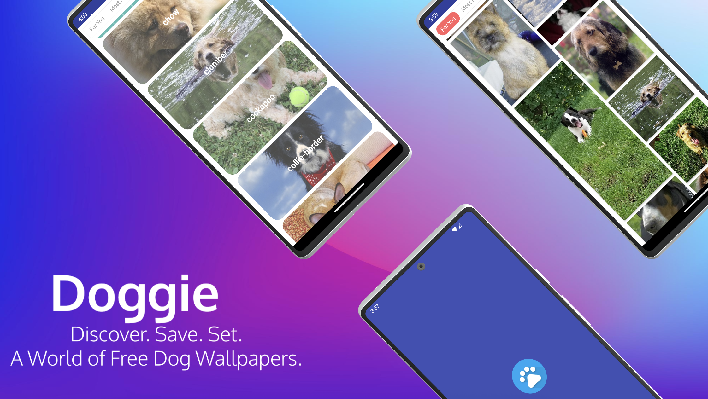
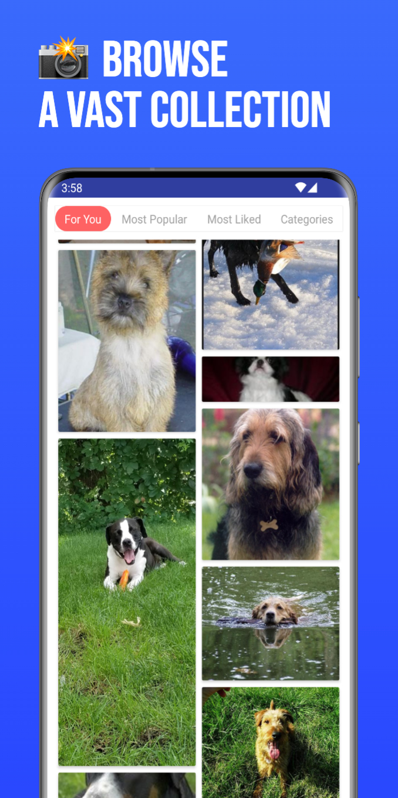
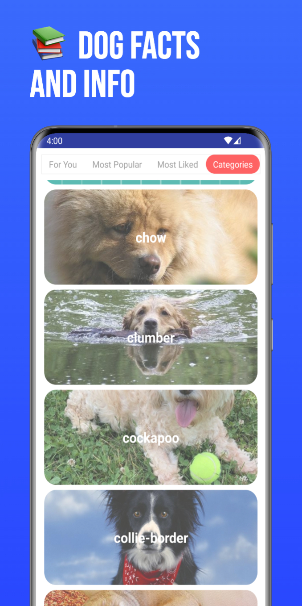
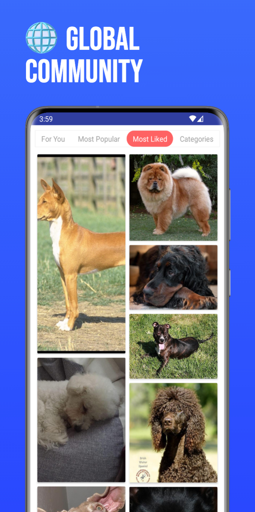
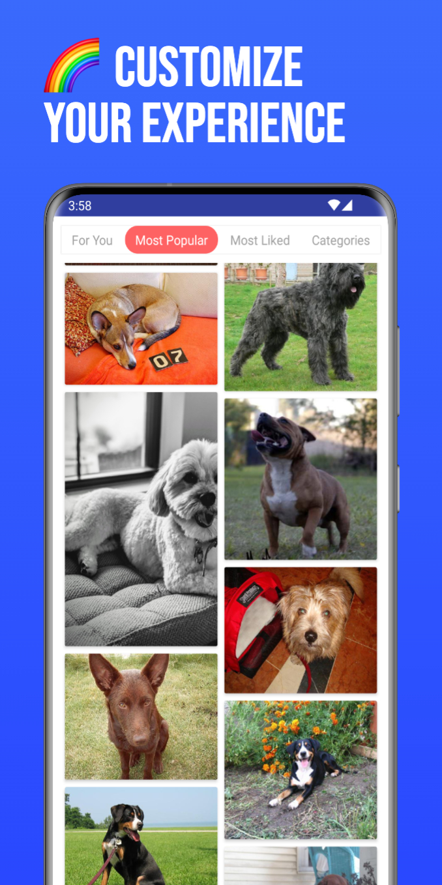
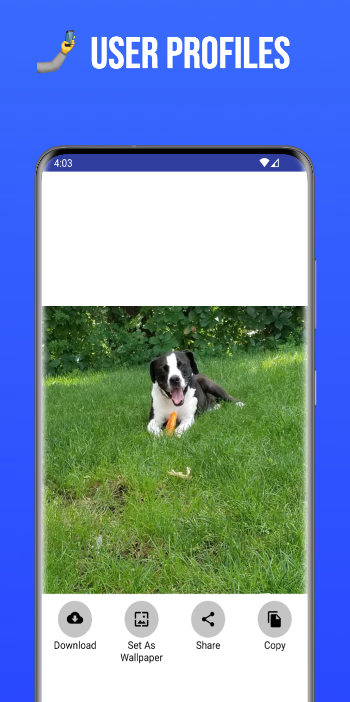

# Doggy Gallery
Doggie-Gallery is an Android application designed to showcase a delightful gallery of dog images. It allows users to browse through pictures of various dog breeds and save their favorite ones.

## Key Features

*   Displays a list of dog images.
*   Allows users to mark and save their favorite images.

## Core Technologies

*   **Programming Language:** Java
*   **Architecture:** Implements the MVVM (Model-View-ViewModel) pattern to separate UI logic from business logic, enhancing testability and maintainability.
*   **Networking:** Utilizes Retrofit for efficient communication with external APIs to fetch data.
*   **Dependency Management:** Employs a custom setup for managing dependencies within the project.

## Modules

*   `:app` ( `Doggie-Gallery.app` ): The main application module containing the core functionality.

## Setup

1.  Clone this repository.
2.  Open the project using Android Studio.
3.  Run the application on an Android emulator or a physical device.

## API Integration

The application integrates with an external API to fetch and display dog images, providing a dynamic content experience.

---

*This README provides an overview of the Doggie-Gallery project.*

Screenshoot
-----------
    

